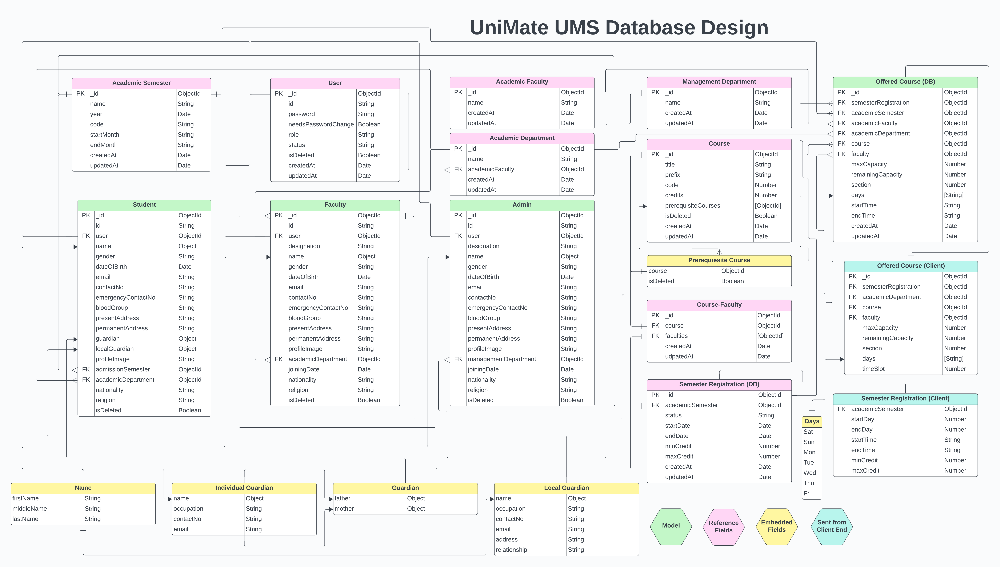

# 🎓 UniMate - University Management System (UMS)

UniMate is a robust and scalable university management backend system designed to manage academic and administrative functionalities for students, faculty, and admin users. It is built with TypeScript, Express.js, MongoDB, and other modern tools, featuring proper error handling, validation, and modular architecture.

## 🚀 Features

-   Full CRUD operations for students, faculty, and admin profiles.
-   Dynamic semester and department management.
-   Comprehensive ID validation and naming conventions.
-   Middleware-driven error handling and async wrapper.
-   Zod-based schema validation for clean and type-safe API requests.
-   Global error handler with specific error mappers (Zod, Mongoose, duplicate, cast).
-   Custom logic like middle name removal and ID formatting checks.
-   Role-based restrictions and utility logic for request validation.
-   Well-structured modular folder architecture.

## 🧰 Technologies Used

-   **Node.js** & **Express.js** – Server & routing
-   **TypeScript** – Strong typing & clean code structure
-   **MongoDB** & **Mongoose** – Database & schema modeling
-   **Zod** – Runtime validation
-   **ESLint** & **Prettier** – Linting & formatting
-   **dotenv** – Environment variable management
-   **HTTP Status** – Clean status messaging
-   **ts-node-dev** – TypeScript development server

## 📁 Project Structure

```
UniMate-UMS/
├── .gitignore
├── README.md
├── analysis-requirements/
│   ├── UniMate-Course-Syllabus.docx
│   ├── UniMate-UMS-Database-Schema.png
│   └── UniMate-UMS-Requirement-Analysis.docx
└── server/
    ├── data/                        # JSON data dumps for seeding/testing
    ├── sample/                      # sample request payloads (student.json, faculty.json, admin.json)
    ├── src/
    │   ├── app/
    │   │   ├── builder/             # QueryBuilder.ts – builds mongoose queries (filter, sort, paginate)
    │   │   ├── config/              # index.ts – loads environment config
    │   │   ├── constant/            # common.ts – shared enums and schemas
    │   │   ├── errors/              # AppError & handlers for Zod, Mongoose, etc.
    │   │   ├── interface/           # common.ts, error.ts – TypeScript types/interfaces
    │   │   ├── middlewares/         # globalErrorHandler.ts, validateRequest.ts, notFound.ts
    │   │   ├── modules/             # feature modules (academicFaculty, student, semesterRegistration, etc.)
    │   │   ├── routes/              # index.ts – central router
    │   │   └── utils/               # catchAsync.ts, sendResponse.ts, idValidator.ts, etc.
    │   ├── app.ts                   # Express app setup (parsers, routes, error middleware)
    │   └── server.ts                # Server entry point & MongoDB connection logic
    ├── .env                         # Environment variables template (see README → [3. Set up environment variables])
    ├── .eslintrc.json               # ESLint configuration for code linting and style enforcement
    ├── .prettierrc.json             # Prettier configuration for consistent code formatting
    ├── tsconfig.json                # TypeScript compiler options and project settings
    ├── package.json                 # npm dependencies, devDependencies & useful scripts
    └── package-lock.json            # Automatically generated lockfile for reproducible installs

```

## 📋 Requirement Analysis

**MVP Scope (MERN‑style web app)**

| Entity                  | Student                                           | Faculty                          | Admin                                       |
| ----------------------- | ------------------------------------------------- | -------------------------------- | ------------------------------------------- |
| **Authentication**      | Login, logout, change password                    | Login, logout, change password   | Login, logout, change password              |
| **Profile Mgmt**        | Edit permitted fields                             | Edit permitted fields            | Edit permitted fields                       |
| **Academic Procedures** | Enroll in courses, view schedule, grades, notices | Manage grades, view student info | Manage semesters, courses, offerings, rooms |
| **User Mgmt**           | —                                                 | —                                | Create/block/unblock users, reset passwords |

_Full API spec and data structure details provided below._

---

### 🗂 Database Schema Overview

A visual representation of the core database models and relationships:



> **_Legend:_**
>
> -   **Pink**: primary collections/models
> -   **Green**: role‑based sub‑collections (Student, Faculty, Admin)
> -   **Yellow**: embedded/value objects (Name, Guardian)
> -   **Cyan**: payloads from client (denormalized views)

---

### 📡 API Endpoints

For a complete list of API specifications, including all endpoints and HTTP methods, refer to the ***API Endpoints and CRUD Operation Methods*** section in the [**Requirement-Analysis**](./analysis-requirements/UniMate-UMS-Requirement-Analysis.pdf) document.

---

## 🛠 Installation & Running Locally

### Prerequisites

-   Node.js
-   MongoDB instance (local or cloud)
-   `.env` file with `PORT` and `DATABASE_URL`

### Steps

1. **Clone the repository:**

    ```bash
    git clone https://github.com/yourusername/UniMate-UMS.git
    cd UniMate-UMS
    ```

2. **Install dependencies:**

    ```bash
    npm install
    ```

3. **Set up environment variables**

    - **_Create a `.env` file in the project root_:**
      Add the following fields:

    ```env
      NODE_ENV
      PORT
      DATABASE_URL
      BCRYPT_SALT_ROUNDS
      DEFAULT_PASS
    ```

    - **_Guide & Configuration Details_:**

        - **APPLICATION ENVIRONMENT:**

            'development' for local testing, 'production' for deployed builds
          
            **`NODE_ENV=development`**
            <br>

        - **SERVER PORT:**

            The port your Express app will listen on
          
            **`PORT=5000`**
            <br>

        - **MONGODB CONNECTION STRING:**

            - **_For a local MongoDB server:_**

                **`DATABASE_URL=mongodb://localhost:27017/unimate`**

            - **_For MongoDB Atlas:_**

                Replace `<user>`, `<pass>`, `<cluster-url>`, `<dbname>` & `<cluster>` with actual values:
                **`DATABASE_URL=mongodb+srv://<user>:<pass>@<cluster-url>/<dbname>?retryWrites=true&w=majority&appName=<cluster>`**
                <br>

        - **BCRYPT SALT ROUNDS:**

            Number of hashing rounds for passwords (integer ≥ 4)

            **`BCRYPT_SALT_ROUNDS=12`**
            <br>

        - **DEFAULT ADMIN PASSWORD:**

            Used only for initial setup—change immediately after first login

            **`DEFAULT_PASS=ChangeMeToASecurePassword!`**
            <br>

4. **Run the development server:**

    ```bash
    npm run dev
    ```

5. **Build for production:**
    ```bash
    npm run build
    npm run prod
    ```

## 🧪 Sample API Testing

Use tools like [Postman](https://www.postman.com/) or [Insomnia](https://insomnia.rest/) to test APIs.

Sample endpoints:

```
- POST: /api/v1/academic-faculties/create-academic-faculty
- GET:  /api/v1/academic-faculties
- GET:  /api/v1/academic-faculties/:id
- PATCH: /api/v1/academic-faculties/:id
```

## 📦 Sample Data

Sample `.json` data files for Student, Faculty, Admin available in `/sample/` folder for testing payloads.

## 📄 License

This project is licensed under the MIT License - see the [LICENSE](LICENSE) file for details.
