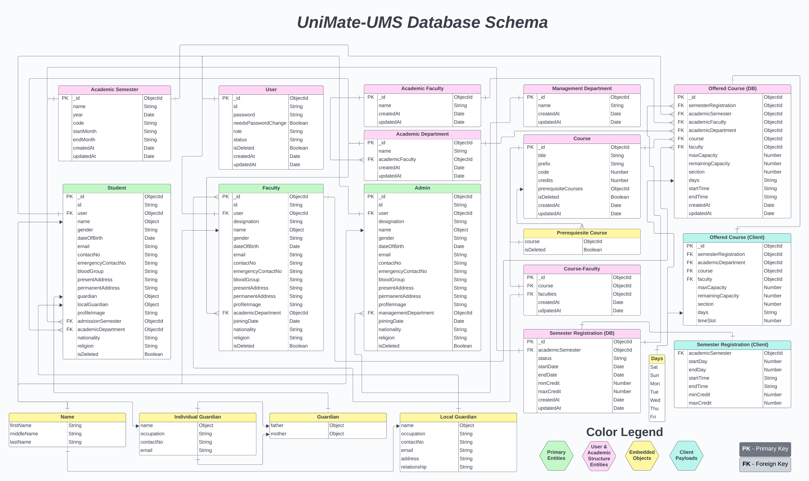

<h1 align="center">
    🎓 UniMate
    <br>
    University Management System (UMS)
</h1>

<h5 align="center">
  <b>Robust, scalable backend for academic and administrative management.<br>Built with TypeScript, Express.js, MongoDB, and modern best practices.</b>
</h5>

<br>

<p align="center">
    UniMate is a robust and scalable university management backend system designed to manage academic and administrative functionalities for students, faculty, and admin users. It is built with TypeScript, Express.js, MongoDB, and other modern tools, featuring proper error handling, validation, and modular architecture.
</p>

<br>

## 📚 Table of Contents

-   [🚀 Features](#-features)
-   [🧰 Technologies Used](#-technologies-used)
-   [📁 Project Structure](#-project-structure)
-   [📋 Requirement Analysis](#-requirement-analysis)
-   [🗂 Database Schema Overview](#-database-schema-overview)
-   [📡 API Endpoints](#-api-endpoints)
-   [🧪 Sample API Testing](#-sample-api-testing)
-   [🔍 Common Advanced Query Features](#-common-advanced-query-features)
-   [📦 Sample Data](#-sample-data)
-   [✅ Prerequisites](#-prerequisites)
-   [🔧 Installation & Running Locally](#-installation--running-locally)
-   [🌐 Live Deployment](#-live-deployment)
-   [🤝 Contributing](#-contributing)
-   [📄 License](#-license)

<br>

## 🚀 Features

-   <b>Full CRUD</b> for students, faculty, and admin profiles
-   <b>Dynamic</b> semester & department management
-   <b>Comprehensive ID validation</b> and naming conventions
-   <b>Middleware-driven</b> error handling & async wrapper
-   <b>Zod-based</b> schema validation for type-safe API requests
-   <b>Global error handler</b> with specific error mappers (Zod, Mongoose, duplicate, cast)
-   <b>Custom logic</b> (middle name removal, ID formatting checks)
-   <b>Role-based restrictions</b> and request validation utilities
-   <b>Modular, scalable folder architecture</b>

<br>

## 🧰 Technologies Used

<div style="display: flex; gap: 10px; flex-wrap: wrap;">
  
  
  
  
  
  
  
  
  
  
  
  
  
</div>

<br>

<details>
   <summary>
      <strong>
         Full list of <i>Packages & Technologies Used</i> (Click to expand)
      </strong>
   </summary>

-   **Node.js**: JavaScript runtime environment for building scalable server-side applications
-   **Express.js**: Web framework for Node.js to handle routing and middleware
-   **TypeScript** – Strong typing & clean code structure
-   **MongoDB**: NoSQL database for storing application data
-   **Mongoose** – Schema modeling
-   **Zod** – Runtime validation
-   **ESLint** – Linting
-   **Prettier** – Formatting
-   **dotenv** – Environment variable management
-   **HTTP Status** – Clean status messaging
-   **ts-node-dev** – TypeScript development server
-   **bcrypt** – Password hashing
-   **validator** – Data validation
-   **CORS** – Cross-Origin Resource Sharing
-   **Vercel** – Cloud deployment
</details>

<br>

## 📁 Project Structure

```
UniMate-UMS/
├── .gitignore                                      # Specifies files and folders to be ignored by Git
├── LICENSE                                         # Project license information (MIT)
├── README.md                                       # Project documentation (this file)
├── analysis-requirements/
│   ├── UniMate-Course-Syllabus.pdf                 # Project syllabus document
│   ├── UniMate-UMS-Database-Schema.png             # Visual ER diagram showing database collections and relationships
│   └── UniMate-UMS-Requirement-Analysis.pdf        # Documents functional requirements, database models, and API endpoints
└── server/
    ├── sample/                                     # sample request payloads (student.json, faculty.json, admin.json)
    ├── src/
    │   ├── app/
    │   │   ├── builder/                            # QueryBuilder.ts – builds mongoose queries (filter, sort, paginate)
    │   │   ├── config/                             # index.ts – loads environment config
    │   │   ├── constant/                           # common.ts – shared enums and schemas
    │   │   ├── errors/                             # AppError & handlers for Zod, Mongoose, etc.
    │   │   ├── interface/                          # common.ts, error.ts – TypeScript types/interfaces
    │   │   ├── middlewares/                        # globalErrorHandler.ts, validateRequest.ts, notFound.ts
    │   │   ├── modules/                            # feature modules (academicFaculty, student, semesterRegistration, etc.)
    │   │   │   ├── moduleName/
    │   │   │   │   ├── moduleName.constant.ts      # Module-specific constants (roles, statuses, default values)
    │   │   │   │   ├── moduleName.controller.ts    # Handles HTTP request/response logic
    │   │   │   │   ├── moduleName.interface.ts     # Module-specific TypeScript types and interfaces
    │   │   │   │   ├── moduleName.model.ts         # Mongoose schema/model definition for the module
    │   │   │   │   ├── moduleName.route.ts         # Express route definitions and API endpoints
    │   │   │   │   ├── moduleName.service.ts       # Core business logic, DB interactions
    │   │   │   │   ├── moduleName.utils.ts         # Utility/helper functions for the module (Optional)
    │   │   │   │   └── moduleName.validation.ts    # Zod schema for validating incoming request bodies
    │   │   │   │
    │   │   │   └── ...                             # Other similar module directories
    │   │   │
    │   │   ├── routes/                             # index.ts – central router
    │   │   └── utils/                              # Utilities - catchAsync.ts, sendResponse.ts, idValidator.ts, etc.
    │   ├── app.ts                                  # Express app setup (parsers, routes, error middleware)
    │   └── server.ts                               # Server entry point & MongoDB connection logic
    ├── .env.example                                # Template Environment variables for local development
    ├── .eslintignore                               # Specifies files and folders to be ignored by ESLint
    ├── .eslintrc.json                              # ESLint configuration for code linting and style enforcement
    ├── .prettierrc.json                            # Prettier configuration for consistent code formatting
    ├── package-lock.json                           # Automatically generated lockfile for reproducible installs
    ├── package.json                                # npm dependencies, devDependencies & useful scripts
    ├── tsconfig.json                               # TypeScript compiler options and project settings
    └── vercel.json                                 # Vercel deployment configuration

```

<br>

## 📋 Requirement Analysis

| Entity                  | Student                                           | Faculty                          | Admin                                       |
| ----------------------- | ------------------------------------------------- | -------------------------------- | ------------------------------------------- |
| **Authentication**      | Login, logout, change password                    | Login, logout, change password   | Login, logout, change password              |
| **Profile Mgmt**        | Edit permitted fields                             | Edit permitted fields            | Edit permitted fields                       |
| **Academic Procedures** | Enroll in courses, view schedule, grades, notices | Manage grades, view student info | Manage semesters, courses, offerings, rooms |
| **User Mgmt**           | —                                                 | —                                | Create/block/unblock users, reset passwords |

_Full API spec and data structure details provided in the analysis document._

<br>

## 🗂 Database Schema Overview

A visual representation of the core database models and relationships:

<p align="center">
  
</p>

> **Legend:**
>
> -   <strong><span style="color:green">GREEN</span>:</strong> Primary entities (Student, Faculty, Admin)
> -   <strong><span style="color:pink">PINK</span>:</strong> User & academic structure entities
> -   <strong><span style="color:yellow">YELLOW</span>:</strong> Embedded objects
> -   <strong><span style="color:cyan">CYAN</span>:</strong> Client payloads (Offered Course, Semester Registration)

> [!IMPORTANT]
> Entities shown under <span style="color:cyan"><i><strong>CYAN</strong></i></span> have the same names as their database counterparts but may differ in structure (client payloads vs. DB models).

<br>

## 📡 API Endpoints

For a complete list of API specifications, including all endpoints and HTTP methods, see the [**_Requirement Analysis PDF_**](./analysis-requirements/UniMate-UMS-Requirement-Analysis.pdf).

**Sample endpoints:**

```http
POST    /api/v1/users/create-student
GET     /api/v1/students
GET     /api/v1/students/S-2021010001
PATCH   /api/v1/students/S-2021010001
DELETE  /api/v1/students/S-2021010001
```

> **Tips:**
>
> -   All endpoints are prefixed with `/api/v1/`
> -   For user operations (admin, faculty, student), use the <b>application-generated user ID</b> (e.g., S-2021010001), not the MongoDB ObjectId.
> -   For other entities (Academic Faculty, Department, etc.), use the MongoDB ObjectId (`_id`).

<br>

## 🧪 Sample API Testing

-   Use [Postman](https://www.postman.com/) or [Insomnia](https://insomnia.rest/) to test APIs.
-   For POST/PATCH, provide the required JSON body.
-   The server responds with JSON for all endpoints.

> **Note:**
>
> -   See [Requirement Analysis PDF](./analysis-requirements/UniMate-UMS-Requirement-Analysis.pdf) for full API route details.
> -   Sample payloads are available in [`server/sample`](./server/sample).

<br>

## 🔍 Common Advanced Query Features

Most GET endpoints (students, faculties, departments, courses, etc.) support:

-   `searchTerm=<keyword>` — partial name/code search
-   `limit=<number>` — limit results per page
-   `page=<number>` — pagination
-   `sort=<field>` — sorting
-   Field-based filters (e.g., `gender=male&bloodGroup=B+`)

Example:

```http
GET   /api/v1/faculties?searchTerm=john&gender=male&page=2&limit=10&sort=name.firstName
```

<br>

## 📦 Sample Data

Sample `.json` data files for Student, Faculty, Admin are available in [`server/sample`](./server/sample) for testing payloads.

<br>

## ✅ Prerequisites

-   [**Node**.js](https://nodejs.org/) (v18 or higher recommended)
-   [**npm**](https://www.npmjs.com/) (comes with Node.js)
-   [**MongoDB**](https://www.mongodb.com/try/download/community) (local or remote)
-   A [**`.env`**](./server/.env.example) file with required environment variables

<br>

## 🔧 Installation & Running Locally

### 1. Clone the repository

```bash
git clone https://github.com/yourusername/UniMate-UMS.git
cd UniMate-UMS/server
```

### 2. Install dependencies

```bash
npm install
```

### 3. Set up environment variables

-   **Rename [`server/.env.example`](./server/.env.example) to `.env` and fill in your credentials:**

    ```env
    NODE_ENV=development
    PORT=5000
    DATABASE_URL=yourDatabaseUser
    BCRYPT_SALT_ROUNDS=12
    DEFAULT_PASS=ChangeMeToASecurePassword!
    ```

-   **Configuration Details:**

    -   <b>NODE_ENV</b>: `development` (local) or `production` (deployed)
    -   <b>PORT</b>: Port your Express app will listen on
    -   <b>DATABASE_URL</b>: MongoDB connection string (local or Atlas)
    -   <b>BCRYPT_SALT_ROUNDS</b>: Password hashing complexity (integer ≥ 4)
    -   <b>DEFAULT_PASS</b>: Default admin password (change after first login)

> ⚠️ <b>Caution:</b> <br> Never commit your `.env` file to version control. Keep it private and add `.env` to your `.gitignore`.

### 4. Run the development server

```bash
npm run dev
```

### 5. Build for production

```bash
npm run build
npm run prod
```

<br>

## 🌐 Live Deployment

The API is deployed on [**_Vercel_**](https://vercel.com/) and is live at [**this following URL**](https://unimate-ums-backend.vercel.app/).

<br>

## 🤝 Contributing

Have ideas to improve this API? Found a bug? [Open an issue](https://github.com/yourusername/UniMate-UMS/issues) or submit a pull request!

<br>

## 📄 License

This project is licensed under the <b>MIT License</b> - see the [LICENSE](LICENSE) file for details.
